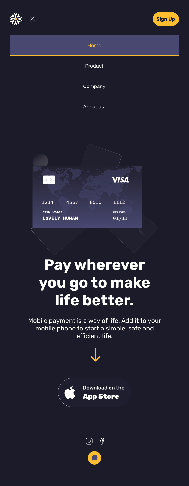

# Sun Payer

Hello World !

This project helped me practice my web-development skills by re-designing & coding this [design shot on dribbble](https://dribbble.com/shots/15438648/attachments/7208171?mode=media). 

### Live Demo
Click [here](https://deltd3v.github.io/ui_sun_payer/) to see the site live.

### Design
Have a look at my re-design for mobile & desktop.
<!--

 -->

### Implementation details
This github repo hosts my source code for the project's static site. [Github Pages](https://pages.github.com/) serves my static site 